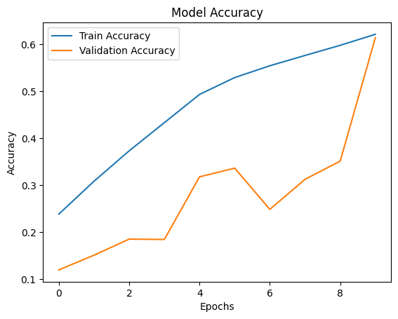
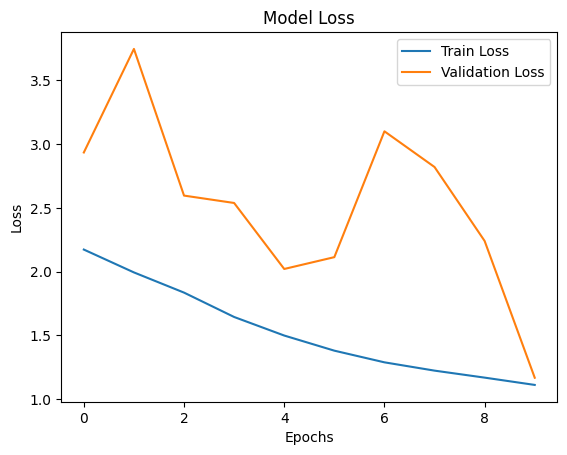
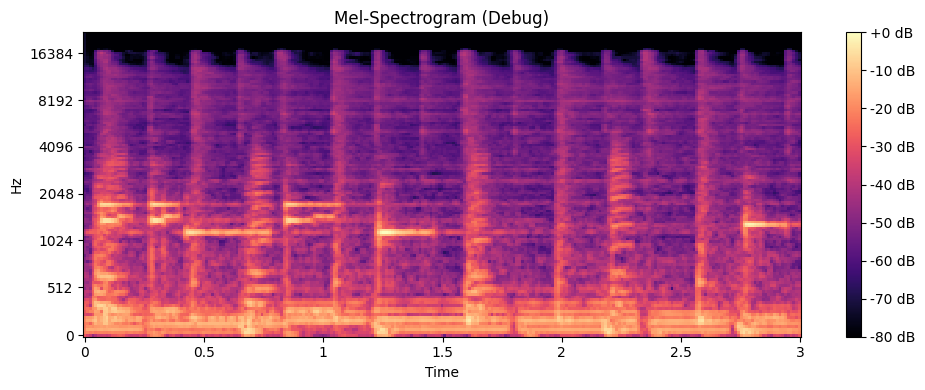

Задача: создать сверточную НС для распознавания музыкального инструмента по аудиодорожке, достигнуть приемлемой точности.\ Для этого необходимо:\
1. Используя соответствующий набор данных для обучения, преобразовать данные в пригодный для обучения НС вид\
2. Обучить сеть, достигнув результатов в обучении (возрастающая точность)

Исходный код и README: https://github.com/justvlike/collab_recognition

Привязка и загрузка содержимого IRMAS c GDrive\
IRMAS доступен для скачивания по ссылке https://zenodo.org/records/1290750#.WzCwSRyxXMU \
для обучения используется IRMAS-TrainingData.zip


```python
from google.colab import drive

# Привязка Google Drive
drive.mount('/content/drive')

```

    Mounted at /content/drive
    

Проверка, подтянуты ли файлы. Если успешно - в составе вывода должен быть архив IRMAS-TrainingData.zip


```python
import os

# Вывод файлов Google Drive
os.listdir('/content/drive/My Drive/University/Maga')

```


    ['ADDITIONS 1st SEMESTER.gdoc',
     'MASTERS 1st SEMESTER.gdoc',
     'IRMAS-TrainingData.zip']


Разархивация архива, помещение подготовленных данных в соостветствующую директорию


```python
import zipfile

zip_file_path = '/content/drive/My Drive/University/Maga/IRMAS-TrainingData.zip'
extract_folder = '/content/irmas_dataset'

# Разархивация загруженного архива
with zipfile.ZipFile(zip_file_path, 'r') as zip_ref:
    zip_ref.extractall(extract_folder)

# Вывод содержимого распакованного архива
os.listdir(extract_folder)

```


    ['IRMAS-TrainingData']


Подготовка зависимостей Python


```python
!pip show tensorflow

```

    Name: tensorflow
    Version: 2.17.1
    Summary: TensorFlow is an open source machine learning framework for everyone.
    Home-page: https://www.tensorflow.org/
    Author: Google Inc.
    Author-email: packages@tensorflow.org
    License: Apache 2.0
    Location: /usr/local/lib/python3.10/dist-packages
    Requires: absl-py, astunparse, flatbuffers, gast, google-pasta, grpcio, h5py, keras, libclang, ml-dtypes, numpy, opt-einsum, packaging, protobuf, requests, setuptools, six, tensorboard, tensorflow-io-gcs-filesystem, termcolor, typing-extensions, wrapt
    Required-by: dopamine_rl, tf_keras
    


```python
!pip install librosa matplotlib tensorflow numpy

```

    Requirement already satisfied: librosa in /usr/local/lib/python3.10/dist-packages (0.10.2.post1)
    Requirement already satisfied: matplotlib in /usr/local/lib/python3.10/dist-packages (3.10.0)
    Requirement already satisfied: tensorflow in /usr/local/lib/python3.10/dist-packages (2.17.1)
    Requirement already satisfied: numpy in /usr/local/lib/python3.10/dist-packages (1.26.4)
    Requirement already satisfied: audioread>=2.1.9 in /usr/local/lib/python3.10/dist-packages (from librosa) (3.0.1)
    Requirement already satisfied: scipy>=1.2.0 in /usr/local/lib/python3.10/dist-packages (from librosa) (1.13.1)
    Requirement already satisfied: scikit-learn>=0.20.0 in /usr/local/lib/python3.10/dist-packages (from librosa) (1.6.0)
    Requirement already satisfied: joblib>=0.14 in /usr/local/lib/python3.10/dist-packages (from librosa) (1.4.2)
    Requirement already satisfied: decorator>=4.3.0 in /usr/local/lib/python3.10/dist-packages (from librosa) (4.4.2)
    Requirement already satisfied: numba>=0.51.0 in /usr/local/lib/python3.10/dist-packages (from librosa) (0.60.0)
    Requirement already satisfied: soundfile>=0.12.1 in /usr/local/lib/python3.10/dist-packages (from librosa) (0.13.0)
    Requirement already satisfied: pooch>=1.1 in /usr/local/lib/python3.10/dist-packages (from librosa) (1.8.2)
    Requirement already satisfied: soxr>=0.3.2 in /usr/local/lib/python3.10/dist-packages (from librosa) (0.5.0.post1)
    Requirement already satisfied: typing-extensions>=4.1.1 in /usr/local/lib/python3.10/dist-packages (from librosa) (4.12.2)
    Requirement already satisfied: lazy-loader>=0.1 in /usr/local/lib/python3.10/dist-packages (from librosa) (0.4)
    Requirement already satisfied: msgpack>=1.0 in /usr/local/lib/python3.10/dist-packages (from librosa) (1.1.0)
    Requirement already satisfied: contourpy>=1.0.1 in /usr/local/lib/python3.10/dist-packages (from matplotlib) (1.3.1)
    Requirement already satisfied: cycler>=0.10 in /usr/local/lib/python3.10/dist-packages (from matplotlib) (0.12.1)
    Requirement already satisfied: fonttools>=4.22.0 in /usr/local/lib/python3.10/dist-packages (from matplotlib) (4.55.3)
    Requirement already satisfied: kiwisolver>=1.3.1 in /usr/local/lib/python3.10/dist-packages (from matplotlib) (1.4.8)
    Requirement already satisfied: packaging>=20.0 in /usr/local/lib/python3.10/dist-packages (from matplotlib) (24.2)
    Requirement already satisfied: pillow>=8 in /usr/local/lib/python3.10/dist-packages (from matplotlib) (11.1.0)
    Requirement already satisfied: pyparsing>=2.3.1 in /usr/local/lib/python3.10/dist-packages (from matplotlib) (3.2.1)
    Requirement already satisfied: python-dateutil>=2.7 in /usr/local/lib/python3.10/dist-packages (from matplotlib) (2.8.2)
    Requirement already satisfied: absl-py>=1.0.0 in /usr/local/lib/python3.10/dist-packages (from tensorflow) (1.4.0)
    Requirement already satisfied: astunparse>=1.6.0 in /usr/local/lib/python3.10/dist-packages (from tensorflow) (1.6.3)
    Requirement already satisfied: flatbuffers>=24.3.25 in /usr/local/lib/python3.10/dist-packages (from tensorflow) (24.12.23)
    Requirement already satisfied: gast!=0.5.0,!=0.5.1,!=0.5.2,>=0.2.1 in /usr/local/lib/python3.10/dist-packages (from tensorflow) (0.6.0)
    Requirement already satisfied: google-pasta>=0.1.1 in /usr/local/lib/python3.10/dist-packages (from tensorflow) (0.2.0)
    Requirement already satisfied: h5py>=3.10.0 in /usr/local/lib/python3.10/dist-packages (from tensorflow) (3.12.1)
    Requirement already satisfied: libclang>=13.0.0 in /usr/local/lib/python3.10/dist-packages (from tensorflow) (18.1.1)
    Requirement already satisfied: ml-dtypes<0.5.0,>=0.3.1 in /usr/local/lib/python3.10/dist-packages (from tensorflow) (0.4.1)
    Requirement already satisfied: opt-einsum>=2.3.2 in /usr/local/lib/python3.10/dist-packages (from tensorflow) (3.4.0)
    Requirement already satisfied: protobuf!=4.21.0,!=4.21.1,!=4.21.2,!=4.21.3,!=4.21.4,!=4.21.5,<5.0.0dev,>=3.20.3 in /usr/local/lib/python3.10/dist-packages (from tensorflow) (4.25.5)
    Requirement already satisfied: requests<3,>=2.21.0 in /usr/local/lib/python3.10/dist-packages (from tensorflow) (2.32.3)
    Requirement already satisfied: setuptools in /usr/local/lib/python3.10/dist-packages (from tensorflow) (75.1.0)
    Requirement already satisfied: six>=1.12.0 in /usr/local/lib/python3.10/dist-packages (from tensorflow) (1.17.0)
    Requirement already satisfied: termcolor>=1.1.0 in /usr/local/lib/python3.10/dist-packages (from tensorflow) (2.5.0)
    Requirement already satisfied: wrapt>=1.11.0 in /usr/local/lib/python3.10/dist-packages (from tensorflow) (1.17.0)
    Requirement already satisfied: grpcio<2.0,>=1.24.3 in /usr/local/lib/python3.10/dist-packages (from tensorflow) (1.69.0)
    Requirement already satisfied: tensorboard<2.18,>=2.17 in /usr/local/lib/python3.10/dist-packages (from tensorflow) (2.17.1)
    Requirement already satisfied: keras>=3.2.0 in /usr/local/lib/python3.10/dist-packages (from tensorflow) (3.5.0)
    Requirement already satisfied: tensorflow-io-gcs-filesystem>=0.23.1 in /usr/local/lib/python3.10/dist-packages (from tensorflow) (0.37.1)
    Requirement already satisfied: wheel<1.0,>=0.23.0 in /usr/local/lib/python3.10/dist-packages (from astunparse>=1.6.0->tensorflow) (0.45.1)
    Requirement already satisfied: rich in /usr/local/lib/python3.10/dist-packages (from keras>=3.2.0->tensorflow) (13.9.4)
    Requirement already satisfied: namex in /usr/local/lib/python3.10/dist-packages (from keras>=3.2.0->tensorflow) (0.0.8)
    Requirement already satisfied: optree in /usr/local/lib/python3.10/dist-packages (from keras>=3.2.0->tensorflow) (0.13.1)
    Requirement already satisfied: llvmlite<0.44,>=0.43.0dev0 in /usr/local/lib/python3.10/dist-packages (from numba>=0.51.0->librosa) (0.43.0)
    Requirement already satisfied: platformdirs>=2.5.0 in /usr/local/lib/python3.10/dist-packages (from pooch>=1.1->librosa) (4.3.6)
    Requirement already satisfied: charset-normalizer<4,>=2 in /usr/local/lib/python3.10/dist-packages (from requests<3,>=2.21.0->tensorflow) (3.4.1)
    Requirement already satisfied: idna<4,>=2.5 in /usr/local/lib/python3.10/dist-packages (from requests<3,>=2.21.0->tensorflow) (3.10)
    Requirement already satisfied: urllib3<3,>=1.21.1 in /usr/local/lib/python3.10/dist-packages (from requests<3,>=2.21.0->tensorflow) (2.3.0)
    Requirement already satisfied: certifi>=2017.4.17 in /usr/local/lib/python3.10/dist-packages (from requests<3,>=2.21.0->tensorflow) (2024.12.14)
    Requirement already satisfied: threadpoolctl>=3.1.0 in /usr/local/lib/python3.10/dist-packages (from scikit-learn>=0.20.0->librosa) (3.5.0)
    Requirement already satisfied: cffi>=1.0 in /usr/local/lib/python3.10/dist-packages (from soundfile>=0.12.1->librosa) (1.17.1)
    Requirement already satisfied: markdown>=2.6.8 in /usr/local/lib/python3.10/dist-packages (from tensorboard<2.18,>=2.17->tensorflow) (3.7)
    Requirement already satisfied: tensorboard-data-server<0.8.0,>=0.7.0 in /usr/local/lib/python3.10/dist-packages (from tensorboard<2.18,>=2.17->tensorflow) (0.7.2)
    Requirement already satisfied: werkzeug>=1.0.1 in /usr/local/lib/python3.10/dist-packages (from tensorboard<2.18,>=2.17->tensorflow) (3.1.3)
    Requirement already satisfied: pycparser in /usr/local/lib/python3.10/dist-packages (from cffi>=1.0->soundfile>=0.12.1->librosa) (2.22)
    Requirement already satisfied: MarkupSafe>=2.1.1 in /usr/local/lib/python3.10/dist-packages (from werkzeug>=1.0.1->tensorboard<2.18,>=2.17->tensorflow) (3.0.2)
    Requirement already satisfied: markdown-it-py>=2.2.0 in /usr/local/lib/python3.10/dist-packages (from rich->keras>=3.2.0->tensorflow) (3.0.0)
    Requirement already satisfied: pygments<3.0.0,>=2.13.0 in /usr/local/lib/python3.10/dist-packages (from rich->keras>=3.2.0->tensorflow) (2.18.0)
    Requirement already satisfied: mdurl~=0.1 in /usr/local/lib/python3.10/dist-packages (from markdown-it-py>=2.2.0->rich->keras>=3.2.0->tensorflow) (0.1.2)
    

Убедиться, что все распаковано успешно и иерархия папок соблюдена - важно при преобразовании wav аудио файлов в спектрограммы позже


```python
import os

# Указываем непосредственно внутрь распакованного архива
dataset_path = '/content/irmas_dataset/'
training_path = os.path.join(dataset_path, 'IRMAS-TrainingData')

# Выводим подкаталоги
os.listdir(training_path)

```


    ['cel',
     'pia',
     'voi',
     'flu',
     'cla',
     'org',
     'tru',
     'gel',
     'gac',
     'sax',
     'vio',
     'README.txt']


Функция преобразования аудио в спектрограммы для обучения


```python
import librosa
import numpy as np

def load_audio_and_convert_to_spectrogram(audio_file, n_mels=128):
    # Загружаем аудио через librosa
    y, sr = librosa.load(audio_file, sr=None)  # Load with original sampling rate
    # Создаем Mel-spectrogram
    spectrogram = librosa.feature.melspectrogram(y=y, sr=sr, n_mels=n_mels)
    # Переводим в log scale для лучшего представления
    log_spectrogram = librosa.power_to_db(spectrogram, ref=np.max)
    return log_spectrogram

```

Подготовка данных для обучения - преобразование аудио в спектрограммы для последующего обучения


```python
import glob

def prepare_training_data(training_path, n_mels=128):
    X = []  # Features (spectrograms)
    y = []  # Labels (instrument classes)

    # Маппим в соответствии с папками в архиве
    instrument_map = {
        'cel': 0, 'cla': 1, 'flu': 2, 'gac': 3, 'gel': 4,
        'org': 5, 'pia': 6, 'sax': 7, 'tru': 8, 'vio': 9, 'voi': 10
    }

    # Проход по всем подкаталогам и непосредственно преобразование
    for instrument, label in instrument_map.items():
        folder_path = os.path.join(training_path, instrument)
        for audio_file in glob.glob(os.path.join(folder_path, '*.wav')):
            spectrogram = load_audio_and_convert_to_spectrogram(audio_file, n_mels=n_mels)
            X.append(spectrogram)
            y.append(label)

    return np.array(X), np.array(y)

# Подготовка данных, вызов функции преобразования
X, y = prepare_training_data(training_path)
print(f"Data prepared: {X.shape}, Labels: {y.shape}")
```

    Data prepared: (6705, 128, 259), Labels: (6705,)
    

Нормализация спектрограмм, преобразование датасетов для НС


```python
from sklearn.model_selection import train_test_split

# Нормализация спектрограмм к облатстям [0, 1]
X = X / np.max(X)

# Разделим данные (80% на обучение, 20% на проверку)
X_train, X_val, y_train, y_val = train_test_split(X, y, test_size=0.2, random_state=42)

# Добавляем параметр для дальнейшего использования сверточной НС
X_train = X_train[..., np.newaxis]
X_val = X_val[..., np.newaxis]

print(f"Training data: {X_train.shape}, Validation data: {X_val.shape}")

```

    Training data: (5364, 128, 259, 1), Validation data: (1341, 128, 259, 1)
    

Построение и тренировка НС с использованием подготовленных данных


```python
import tensorflow as tf
from tensorflow.keras import layers, models

# Модель сверточной НС
def build_model(input_shape, num_classes):
    model = models.Sequential([
        # Первый сверточный блок
        layers.Conv2D(32, (3, 3), activation='relu', padding='same', input_shape=input_shape),
        layers.BatchNormalization(),
        layers.MaxPooling2D((2, 2)),
        layers.Dropout(0.3),

        # Второй сверточный блок
        layers.Conv2D(64, (3, 3), activation='relu', padding='same'),
        layers.BatchNormalization(),
        layers.MaxPooling2D((2, 2)),
        layers.Dropout(0.3),

        # Третий сверточный блок
        layers.Conv2D(128, (3, 3), activation='relu', padding='same'),
        layers.BatchNormalization(),
        layers.MaxPooling2D((2, 2)),
        layers.Dropout(0.3),

        # Дополнительные слои
        layers.GlobalAveragePooling2D(),
        layers.Dense(256, activation='relu'),
        layers.Dropout(0.5),
        layers.Dense(num_classes, activation='softmax')
    ])
    model.compile(optimizer='adam',
                  loss='categorical_crossentropy',
                  metrics=['accuracy'])
    return model

```


```python
from tensorflow.keras.utils import to_categorical

# Преобразование y_train и y_val в более удобный формат.
y_train = to_categorical(y_train, num_classes=len(set(y)))
y_val = to_categorical(y_val, num_classes=len(set(y)))

```


```python
# Строим модель
input_shape = X_train.shape[1:]  # Размер спектрограмм
num_classes = len(set(y))  # Количество типов классов
model = build_model(input_shape, num_classes)
model.summary()

# Обучаем модель
history = model.fit(
    X_train, y_train,
    validation_data=(X_val, y_val),
    epochs=10,  # Больше проходов - сильнее обучение
    batch_size=32
)

```


<pre style="white-space:pre;overflow-x:auto;line-height:normal;font-family:Menlo,'DejaVu Sans Mono',consolas,'Courier New',monospace"><span style="font-weight: bold">Model: "sequential_1"</span>
</pre>


<pre style="white-space:pre;overflow-x:auto;line-height:normal;font-family:Menlo,'DejaVu Sans Mono',consolas,'Courier New',monospace">┏━━━━━━━━━━━━━━━━━━━━━━━━━━━━━━━━━━━━━━┳━━━━━━━━━━━━━━━━━━━━━━━━━━━━━┳━━━━━━━━━━━━━━━━━┓
┃<span style="font-weight: bold"> Layer (type)                         </span>┃<span style="font-weight: bold"> Output Shape                </span>┃<span style="font-weight: bold">         Param # </span>┃
┡━━━━━━━━━━━━━━━━━━━━━━━━━━━━━━━━━━━━━━╇━━━━━━━━━━━━━━━━━━━━━━━━━━━━━╇━━━━━━━━━━━━━━━━━┩
│ conv2d_3 (<span style="color: #0087ff; text-decoration-color: #0087ff">Conv2D</span>)                    │ (<span style="color: #00d7ff; text-decoration-color: #00d7ff">None</span>, <span style="color: #00af00; text-decoration-color: #00af00">128</span>, <span style="color: #00af00; text-decoration-color: #00af00">259</span>, <span style="color: #00af00; text-decoration-color: #00af00">32</span>)        │             <span style="color: #00af00; text-decoration-color: #00af00">320</span> │
├──────────────────────────────────────┼─────────────────────────────┼─────────────────┤
│ batch_normalization_3                │ (<span style="color: #00d7ff; text-decoration-color: #00d7ff">None</span>, <span style="color: #00af00; text-decoration-color: #00af00">128</span>, <span style="color: #00af00; text-decoration-color: #00af00">259</span>, <span style="color: #00af00; text-decoration-color: #00af00">32</span>)        │             <span style="color: #00af00; text-decoration-color: #00af00">128</span> │
│ (<span style="color: #0087ff; text-decoration-color: #0087ff">BatchNormalization</span>)                 │                             │                 │
├──────────────────────────────────────┼─────────────────────────────┼─────────────────┤
│ max_pooling2d_3 (<span style="color: #0087ff; text-decoration-color: #0087ff">MaxPooling2D</span>)       │ (<span style="color: #00d7ff; text-decoration-color: #00d7ff">None</span>, <span style="color: #00af00; text-decoration-color: #00af00">64</span>, <span style="color: #00af00; text-decoration-color: #00af00">129</span>, <span style="color: #00af00; text-decoration-color: #00af00">32</span>)         │               <span style="color: #00af00; text-decoration-color: #00af00">0</span> │
├──────────────────────────────────────┼─────────────────────────────┼─────────────────┤
│ dropout_4 (<span style="color: #0087ff; text-decoration-color: #0087ff">Dropout</span>)                  │ (<span style="color: #00d7ff; text-decoration-color: #00d7ff">None</span>, <span style="color: #00af00; text-decoration-color: #00af00">64</span>, <span style="color: #00af00; text-decoration-color: #00af00">129</span>, <span style="color: #00af00; text-decoration-color: #00af00">32</span>)         │               <span style="color: #00af00; text-decoration-color: #00af00">0</span> │
├──────────────────────────────────────┼─────────────────────────────┼─────────────────┤
│ conv2d_4 (<span style="color: #0087ff; text-decoration-color: #0087ff">Conv2D</span>)                    │ (<span style="color: #00d7ff; text-decoration-color: #00d7ff">None</span>, <span style="color: #00af00; text-decoration-color: #00af00">64</span>, <span style="color: #00af00; text-decoration-color: #00af00">129</span>, <span style="color: #00af00; text-decoration-color: #00af00">64</span>)         │          <span style="color: #00af00; text-decoration-color: #00af00">18,496</span> │
├──────────────────────────────────────┼─────────────────────────────┼─────────────────┤
│ batch_normalization_4                │ (<span style="color: #00d7ff; text-decoration-color: #00d7ff">None</span>, <span style="color: #00af00; text-decoration-color: #00af00">64</span>, <span style="color: #00af00; text-decoration-color: #00af00">129</span>, <span style="color: #00af00; text-decoration-color: #00af00">64</span>)         │             <span style="color: #00af00; text-decoration-color: #00af00">256</span> │
│ (<span style="color: #0087ff; text-decoration-color: #0087ff">BatchNormalization</span>)                 │                             │                 │
├──────────────────────────────────────┼─────────────────────────────┼─────────────────┤
│ max_pooling2d_4 (<span style="color: #0087ff; text-decoration-color: #0087ff">MaxPooling2D</span>)       │ (<span style="color: #00d7ff; text-decoration-color: #00d7ff">None</span>, <span style="color: #00af00; text-decoration-color: #00af00">32</span>, <span style="color: #00af00; text-decoration-color: #00af00">64</span>, <span style="color: #00af00; text-decoration-color: #00af00">64</span>)          │               <span style="color: #00af00; text-decoration-color: #00af00">0</span> │
├──────────────────────────────────────┼─────────────────────────────┼─────────────────┤
│ dropout_5 (<span style="color: #0087ff; text-decoration-color: #0087ff">Dropout</span>)                  │ (<span style="color: #00d7ff; text-decoration-color: #00d7ff">None</span>, <span style="color: #00af00; text-decoration-color: #00af00">32</span>, <span style="color: #00af00; text-decoration-color: #00af00">64</span>, <span style="color: #00af00; text-decoration-color: #00af00">64</span>)          │               <span style="color: #00af00; text-decoration-color: #00af00">0</span> │
├──────────────────────────────────────┼─────────────────────────────┼─────────────────┤
│ conv2d_5 (<span style="color: #0087ff; text-decoration-color: #0087ff">Conv2D</span>)                    │ (<span style="color: #00d7ff; text-decoration-color: #00d7ff">None</span>, <span style="color: #00af00; text-decoration-color: #00af00">32</span>, <span style="color: #00af00; text-decoration-color: #00af00">64</span>, <span style="color: #00af00; text-decoration-color: #00af00">128</span>)         │          <span style="color: #00af00; text-decoration-color: #00af00">73,856</span> │
├──────────────────────────────────────┼─────────────────────────────┼─────────────────┤
│ batch_normalization_5                │ (<span style="color: #00d7ff; text-decoration-color: #00d7ff">None</span>, <span style="color: #00af00; text-decoration-color: #00af00">32</span>, <span style="color: #00af00; text-decoration-color: #00af00">64</span>, <span style="color: #00af00; text-decoration-color: #00af00">128</span>)         │             <span style="color: #00af00; text-decoration-color: #00af00">512</span> │
│ (<span style="color: #0087ff; text-decoration-color: #0087ff">BatchNormalization</span>)                 │                             │                 │
├──────────────────────────────────────┼─────────────────────────────┼─────────────────┤
│ max_pooling2d_5 (<span style="color: #0087ff; text-decoration-color: #0087ff">MaxPooling2D</span>)       │ (<span style="color: #00d7ff; text-decoration-color: #00d7ff">None</span>, <span style="color: #00af00; text-decoration-color: #00af00">16</span>, <span style="color: #00af00; text-decoration-color: #00af00">32</span>, <span style="color: #00af00; text-decoration-color: #00af00">128</span>)         │               <span style="color: #00af00; text-decoration-color: #00af00">0</span> │
├──────────────────────────────────────┼─────────────────────────────┼─────────────────┤
│ dropout_6 (<span style="color: #0087ff; text-decoration-color: #0087ff">Dropout</span>)                  │ (<span style="color: #00d7ff; text-decoration-color: #00d7ff">None</span>, <span style="color: #00af00; text-decoration-color: #00af00">16</span>, <span style="color: #00af00; text-decoration-color: #00af00">32</span>, <span style="color: #00af00; text-decoration-color: #00af00">128</span>)         │               <span style="color: #00af00; text-decoration-color: #00af00">0</span> │
├──────────────────────────────────────┼─────────────────────────────┼─────────────────┤
│ global_average_pooling2d_1           │ (<span style="color: #00d7ff; text-decoration-color: #00d7ff">None</span>, <span style="color: #00af00; text-decoration-color: #00af00">128</span>)                 │               <span style="color: #00af00; text-decoration-color: #00af00">0</span> │
│ (<span style="color: #0087ff; text-decoration-color: #0087ff">GlobalAveragePooling2D</span>)             │                             │                 │
├──────────────────────────────────────┼─────────────────────────────┼─────────────────┤
│ dense_2 (<span style="color: #0087ff; text-decoration-color: #0087ff">Dense</span>)                      │ (<span style="color: #00d7ff; text-decoration-color: #00d7ff">None</span>, <span style="color: #00af00; text-decoration-color: #00af00">256</span>)                 │          <span style="color: #00af00; text-decoration-color: #00af00">33,024</span> │
├──────────────────────────────────────┼─────────────────────────────┼─────────────────┤
│ dropout_7 (<span style="color: #0087ff; text-decoration-color: #0087ff">Dropout</span>)                  │ (<span style="color: #00d7ff; text-decoration-color: #00d7ff">None</span>, <span style="color: #00af00; text-decoration-color: #00af00">256</span>)                 │               <span style="color: #00af00; text-decoration-color: #00af00">0</span> │
├──────────────────────────────────────┼─────────────────────────────┼─────────────────┤
│ dense_3 (<span style="color: #0087ff; text-decoration-color: #0087ff">Dense</span>)                      │ (<span style="color: #00d7ff; text-decoration-color: #00d7ff">None</span>, <span style="color: #00af00; text-decoration-color: #00af00">11</span>)                  │           <span style="color: #00af00; text-decoration-color: #00af00">2,827</span> │
└──────────────────────────────────────┴─────────────────────────────┴─────────────────┘
</pre>


<pre style="white-space:pre;overflow-x:auto;line-height:normal;font-family:Menlo,'DejaVu Sans Mono',consolas,'Courier New',monospace"><span style="font-weight: bold"> Total params: </span><span style="color: #00af00; text-decoration-color: #00af00">129,419</span> (505.54 KB)
</pre>


<pre style="white-space:pre;overflow-x:auto;line-height:normal;font-family:Menlo,'DejaVu Sans Mono',consolas,'Courier New',monospace"><span style="font-weight: bold"> Trainable params: </span><span style="color: #00af00; text-decoration-color: #00af00">128,971</span> (503.79 KB)
</pre>


<pre style="white-space:pre;overflow-x:auto;line-height:normal;font-family:Menlo,'DejaVu Sans Mono',consolas,'Courier New',monospace"><span style="font-weight: bold"> Non-trainable params: </span><span style="color: #00af00; text-decoration-color: #00af00">448</span> (1.75 KB)
</pre>


    Epoch 1/10
    168/168 ━━━━━━━━━━━━━━━━━━━━ 754s 4s/step - accuracy: 0.2066 - loss: 2.2685 - val_accuracy: 0.1193 - val_loss: 2.9341
    Epoch 2/10
    168/168 ━━━━━━━━━━━━━━━━━━━━ 755s 4s/step - accuracy: 0.2839 - loss: 2.0398 - val_accuracy: 0.1506 - val_loss: 3.7466
    Epoch 3/10
    168/168 ━━━━━━━━━━━━━━━━━━━━ 776s 4s/step - accuracy: 0.3483 - loss: 1.8786 - val_accuracy: 0.1849 - val_loss: 2.5960
    Epoch 4/10
    168/168 ━━━━━━━━━━━━━━━━━━━━ 736s 4s/step - accuracy: 0.4191 - loss: 1.6926 - val_accuracy: 0.1842 - val_loss: 2.5380
    Epoch 5/10
    168/168 ━━━━━━━━━━━━━━━━━━━━ 748s 4s/step - accuracy: 0.4927 - loss: 1.5033 - val_accuracy: 0.3177 - val_loss: 2.0202
    Epoch 6/10
    168/168 ━━━━━━━━━━━━━━━━━━━━ 746s 4s/step - accuracy: 0.5239 - loss: 1.3812 - val_accuracy: 0.3363 - val_loss: 2.1130
    Epoch 7/10
    168/168 ━━━━━━━━━━━━━━━━━━━━ 725s 4s/step - accuracy: 0.5541 - loss: 1.3026 - val_accuracy: 0.2483 - val_loss: 3.1002
    Epoch 8/10
    168/168 ━━━━━━━━━━━━━━━━━━━━ 746s 4s/step - accuracy: 0.5759 - loss: 1.2399 - val_accuracy: 0.3125 - val_loss: 2.8201
    Epoch 9/10
    168/168 ━━━━━━━━━━━━━━━━━━━━ 741s 4s/step - accuracy: 0.5953 - loss: 1.1768 - val_accuracy: 0.3512 - val_loss: 2.2399
    Epoch 10/10
    168/168 ━━━━━━━━━━━━━━━━━━━━ 722s 4s/step - accuracy: 0.6235 - loss: 1.1288 - val_accuracy: 0.6145 - val_loss: 1.1670
    

Построим графики точности и валидации


```python
import matplotlib.pyplot as plt

# График точности
plt.plot(history.history['accuracy'], label='Train Accuracy')
plt.plot(history.history['val_accuracy'], label='Validation Accuracy')
plt.legend()
plt.title('Model Accuracy')
plt.xlabel('Epochs')
plt.ylabel('Accuracy')
plt.show()

# График валидации
plt.plot(history.history['loss'], label='Train Loss')
plt.plot(history.history['val_loss'], label='Validation Loss')
plt.legend()
plt.title('Model Loss')
plt.xlabel('Epochs')
plt.ylabel('Loss')
plt.show()

```


    

    


    

    


Можно проверить точность модели, а также сохранить ее образ


```python
# Точность
val_loss, val_accuracy = model.evaluate(X_val, y_val)
print(f"Validation Accuracy: {val_accuracy * 100:.2f}%")

# Сохраняем модель
model.save('/content/instrument_classifier_model.h5')
```

    42/42 ━━━━━━━━━━━━━━━━━━━━ 36s 861ms/step - accuracy: 0.6296 - loss: 1.1444
    

    WARNING:absl:You are saving your model as an HDF5 file via `model.save()` or `keras.saving.save_model(model)`. This file format is considered legacy. We recommend using instead the native Keras format, e.g. `model.save('my_model.keras')` or `keras.saving.save_model(model, 'my_model.keras')`. 
    

    Validation Accuracy: 61.45%
    

Теперь можно проверить распознавание на реальном результате


```python
import matplotlib.pyplot as plt
import librosa.display

# Функция отладки
def load_audio_and_convert_to_spectrogram_debug(audio_file, n_mels=128):
    import librosa
    import numpy as np

    try:
        # Загружаем аудио
        y, sr = librosa.load(audio_file, sr=None)
        print(f"Loaded audio shape: {y.shape}, Sample rate: {sr}")
        print(f"Max amplitude: {np.max(y)}, Min amplitude: {np.min(y)}")

        # Проверяем, если сигнал пустой
        if len(y) == 0 or np.max(y) == 0:
            raise ValueError("Audio file is silent or empty!")

        # Конвертируем в мел-спектрограмму
        spectrogram = librosa.feature.melspectrogram(y=y, sr=sr, n_mels=n_mels)
        print(f"Spectrogram shape: {spectrogram.shape}")
        print(f"Spectrogram max: {np.max(spectrogram)}, min: {np.min(spectrogram)}")

        # Проверяем, содержит ли спектрограмма только нули
        if np.max(spectrogram) > 0:
            normalized_spectrogram = spectrogram / np.max(spectrogram)  # Нормализация
        else:
            raise ValueError("Spectrogram contains only zeros! Check the audio file or preprocessing steps.")

        # Визуализируем спектрограмму
        plt.figure(figsize=(10, 4))
        librosa.display.specshow(librosa.power_to_db(spectrogram, ref=np.max),
                                 sr=sr, x_axis='time', y_axis='mel')
        plt.colorbar(format='%+2.0f dB')
        plt.title('Mel-Spectrogram (Debug)')
        plt.tight_layout()
        plt.show()

        return normalized_spectrogram
    except Exception as e:
        print(f"Error processing file {audio_file}: {e}")
        raise

# Последний блок
# Список доступных инструментов
instrument_map = {
    'cel': 0, 'cla': 1, 'flu': 2, 'gac': 3, 'gel': 4,
    'org': 5, 'pia': 6, 'sax': 7, 'tru': 8, 'vio': 9, 'voi': 10
}

# Инвертируем map
instrument_map_inv = {v: k for k, v in instrument_map.items()}

# Загружаем тестовый файл
test_audio_file = '/content/irmas_dataset/IRMAS-TrainingData/org/[org][jaz_blu]1045__2.wav'

# Используем функцию отладки
test_spectrogram = load_audio_and_convert_to_spectrogram_debug(test_audio_file)

# Добавляем ось для модели
test_spectrogram = test_spectrogram[np.newaxis, ..., np.newaxis]

# Делаем предсказание
predicted_label = model.predict(test_spectrogram).argmax()
print(f"Predicted Instrument: {instrument_map_inv[predicted_label]}")

```

    Loaded audio shape: (132299,), Sample rate: 44100
    Max amplitude: 0.45159912109375, Min amplitude: -0.488983154296875
    Spectrogram shape: (128, 259)
    Spectrogram max: 305.1554260253906, min: 6.765408788744764e-10
    


    

    


    1/1 ━━━━━━━━━━━━━━━━━━━━ 0s 40ms/step
    Predicted Instrument: org
    
